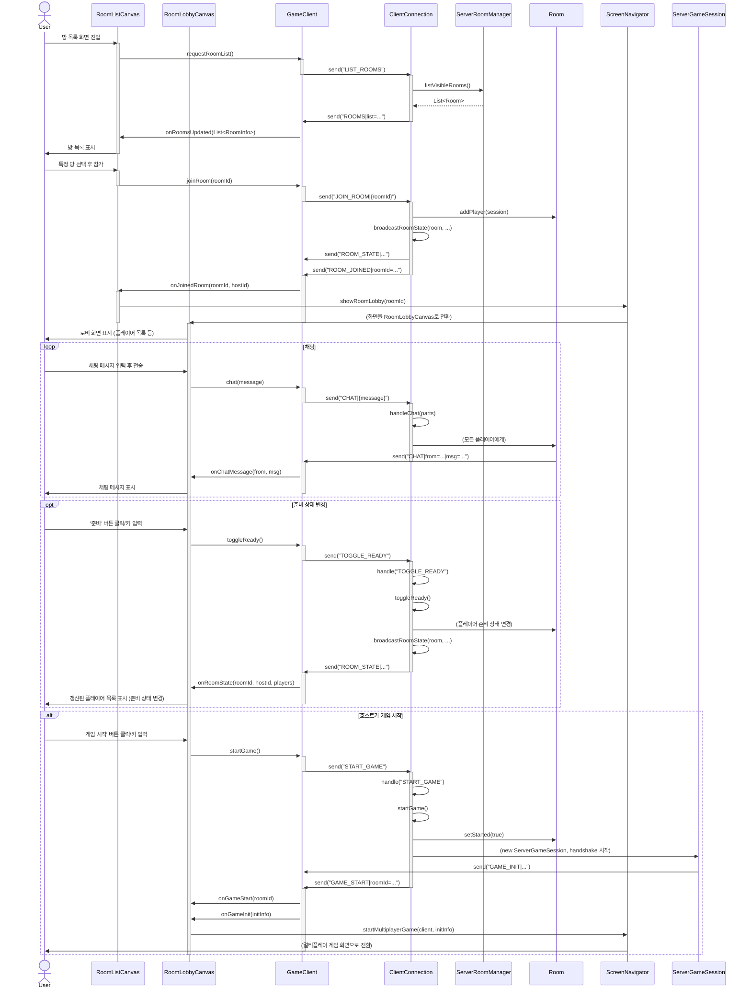

```mermaid
sequenceDiagram
    actor User
    participant RLC as RoomListCanvas
    participant RLCa as RoomLobbyCanvas
    participant GC as GameClient
    participant S as ClientConnection
    participant SRM as ServerRoomManager
    participant R as Room
    participant SN as ScreenNavigator
    participant SGS as ServerGameSession

    %% 1. 방 목록 확인 및 입장
    User->>RLC: 방 목록 화면 진입
    activate RLC
    RLC->>GC: requestRoomList()
    activate GC
    GC->>S: send("LIST_ROOMS")
    deactivate GC
    activate S
    S->>SRM: listVisibleRooms()
    SRM-->>S: List<Room>
    S->>GC: send("ROOMS|list=...")
    deactivate S
    activate GC
    GC->>RLC: onRoomsUpdated(List<RoomInfo>)
    RLC->>User: 방 목록 표시
    deactivate RLC

    User->>RLC: 특정 방 선택 후 참가
    activate RLC
    RLC->>GC: joinRoom(roomId)
    deactivate RLC
    activate GC
    GC->>S: send("JOIN_ROOM|{roomId}")
    deactivate GC
    activate S
    S->>R: addPlayer(session)
    S->>S: broadcastRoomState(room, ...)
    S->>GC: send("ROOM_STATE|...")
    S->>GC: send("ROOM_JOINED|roomId=...")
    deactivate S

    activate GC
    GC->>RLC: onJoinedRoom(roomId, hostId)
    activate RLC
    RLC->>SN: showRoomLobby(roomId)
    SN->>RLCa: (화면을 RoomLobbyCanvas로 전환)
    deactivate RLC
    deactivate GC

    %% 2. 로비에서의 상호작용
    activate RLCa
    RLCa->>User: 로비 화면 표시 (플레이어 목록 등)

    loop 채팅
        User->>RLCa: 채팅 메시지 입력 후 전송
        RLCa->>GC: chat(message)
        activate GC
        GC->>S: send("CHAT|{message}")
        deactivate GC
        activate S
        S->>S: handleChat(parts)
        S->>R: (모든 플레이어에게)
        R->>GC: send("CHAT|from=...|msg=...")
        deactivate S
        activate GC
        GC->>RLCa: onChatMessage(from, msg)
        RLCa->>User: 채팅 메시지 표시
        deactivate GC
    end

    opt 준비 상태 변경
        User->>RLCa: '준비' 버튼 클릭/키 입력
        RLCa->>GC: toggleReady()
        activate GC
        GC->>S: send("TOGGLE_READY")
        deactivate GC
        activate S
        S->>S: handle("TOGGLE_READY")
        S->>S: toggleReady()
        S->>R: (플레이어 준비 상태 변경)
        S->>S: broadcastRoomState(room, ...)
        S->>GC: send("ROOM_STATE|...")
        deactivate S
        activate GC
        GC->>RLCa: onRoomState(roomId, hostId, players)
        RLCa->>User: 갱신된 플레이어 목록 표시 (준비 상태 변경)
        deactivate GC
    end

    %% 3. 게임 시작 (호스트만 가능)
    alt 호스트가 게임 시작
        User->>RLCa: '게임 시작' 버튼 클릭/키 입력
        RLCa->>GC: startGame()
        activate GC
        GC->>S: send("START_GAME")
        deactivate GC
        activate S
        S->>S: handle("START_GAME")
        S->>S: startGame()
        S->>R: setStarted(true)
        S->>SGS: (new ServerGameSession, handshake 시작)
        SGS->>GC: send("GAME_INIT|...")
        S->>GC: send("GAME_START|roomId=...")
        deactivate S

        activate GC
        GC->>RLCa: onGameStart(roomId)
        GC->>RLCa: onGameInit(initInfo)
        RLCa->>SN: startMultiplayerGame(client, initInfo)
        SN->>User: (멀티플레이 게임 화면으로 전환)
        deactivate GC
    end
    deactivate RLCa
```
