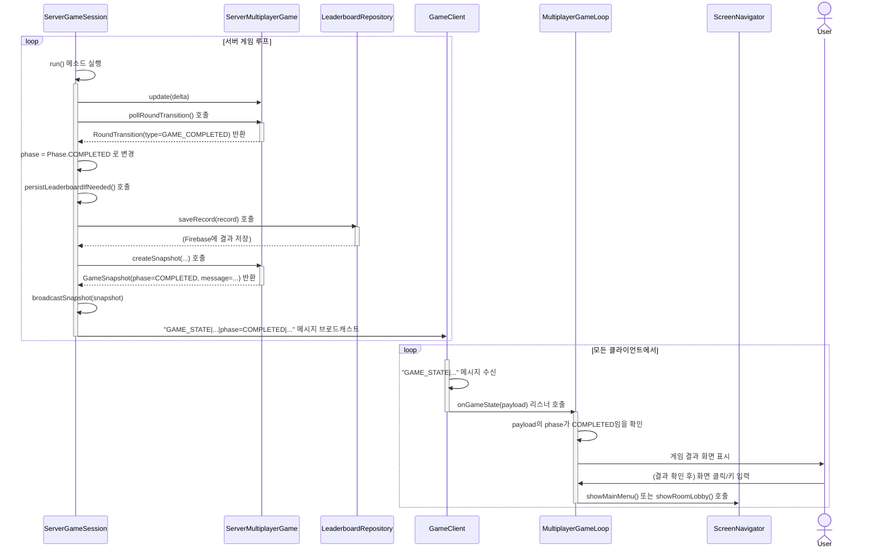

```mermaid
sequenceDiagram
    participant SGS as ServerGameSession
    participant SMG as ServerMultiplayerGame
    participant LR as LeaderboardRepository
    participant GC as GameClient
    participant MGL as MultiplayerGameLoop
    participant SN as ScreenNavigator
    actor User

    loop 서버 게임 루프
        SGS->>SGS: run() 메소드 실행
        activate SGS
        SGS->>SMG: update(delta)
        SGS->>SMG: pollRoundTransition() 호출
        activate SMG
        SMG-->>SGS: RoundTransition(type=GAME_COMPLETED) 반환
        deactivate SMG
        
        SGS->>SGS: phase = Phase.COMPLETED 로 변경
        SGS->>SGS: persistLeaderboardIfNeeded() 호출
        SGS->>LR: saveRecord(record) 호출
        activate LR
        LR-->>SGS: (Firebase에 결과 저장)
        deactivate LR
        
        SGS->>SMG: createSnapshot(...) 호출
        activate SMG
        SMG-->>SGS: GameSnapshot(phase=COMPLETED, message=...) 반환
        deactivate SMG
        
        SGS->>SGS: broadcastSnapshot(snapshot)
        SGS->>GC: "GAME_STATE|...|phase=COMPLETED|..." 메시지 브로드캐스트
        deactivate SGS
    end

    loop 모든 클라이언트에서
        activate GC
        GC->>GC: "GAME_STATE|..." 메시지 수신
        GC->>MGL: onGameState(payload) 리스너 호출
        deactivate GC
        activate MGL
        MGL->>MGL: payload의 phase가 COMPLETED임을 확인
        MGL->>User: 게임 결과 화면 표시
        
        User->>MGL: (결과 확인 후) 화면 클릭/키 입력
        MGL->>SN: showMainMenu() 또는 showRoomLobby() 호출
        deactivate MGL
    end
```