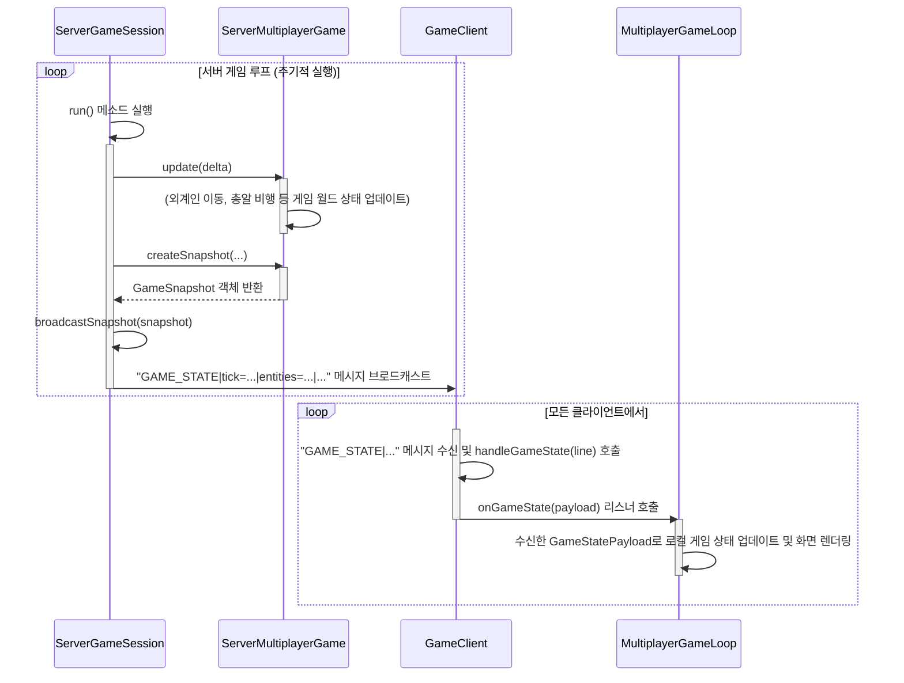

```mermaid
sequenceDiagram
    participant SGS as ServerGameSession
    participant SMG as ServerMultiplayerGame
    participant GC as GameClient
    participant MGL as MultiplayerGameLoop

    loop 서버 게임 루프 (주기적 실행)
        SGS->>SGS: run() 메소드 실행
        activate SGS
        SGS->>SMG: update(delta)
        activate SMG
        SMG->>SMG: (외계인 이동, 총알 비행 등 게임 월드 상태 업데이트)
        deactivate SMG
        SGS->>SMG: createSnapshot(...)
        activate SMG
        SMG-->>SGS: GameSnapshot 객체 반환
        deactivate SMG
        SGS->>SGS: broadcastSnapshot(snapshot)
        SGS->>GC: "GAME_STATE|tick=...|entities=...|..." 메시지 브로드캐스트
        deactivate SGS
    end

    loop 모든 클라이언트에서
        activate GC
        GC->>GC: "GAME_STATE|..." 메시지 수신 및 handleGameState(line) 호출
        GC->>MGL: onGameState(payload) 리스너 호출
        deactivate GC
        activate MGL
        MGL->>MGL: 수신한 GameStatePayload로 로컬 게임 상태 업데이트 및 화면 렌더링
        deactivate MGL
    end
```