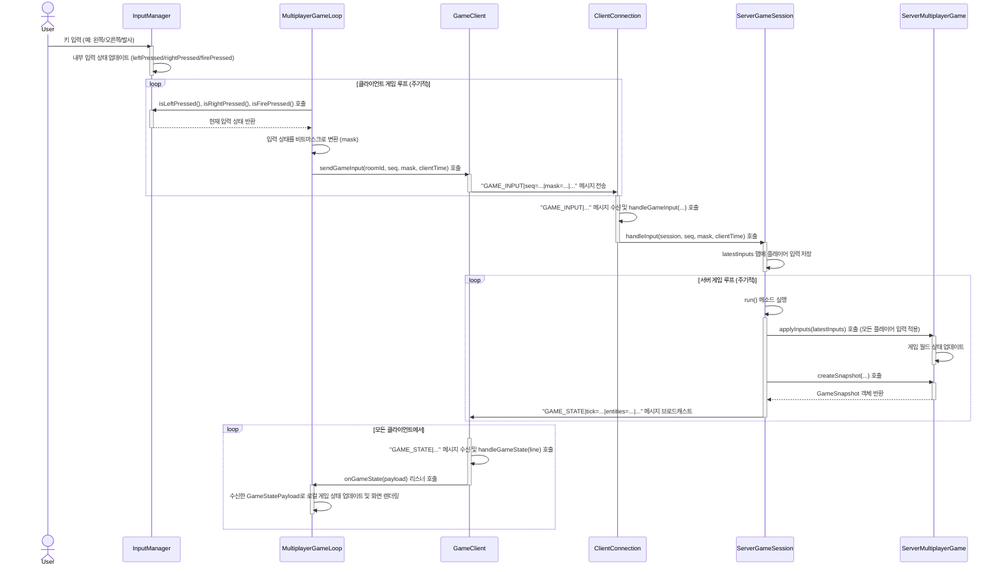

```mermaid
sequenceDiagram
    actor User
    participant IM as InputManager
    participant MGL as MultiplayerGameLoop
    participant GC as GameClient
    participant CC as ClientConnection
    participant SGS as ServerGameSession
    participant SMG as ServerMultiplayerGame

    User->>IM: 키 입력 (예: 왼쪽/오른쪽/발사)
    activate IM
    IM->>IM: 내부 입력 상태 업데이트 (leftPressed/rightPressed/firePressed)
    deactivate IM

    loop 클라이언트 게임 루프 (주기적)
        MGL->>IM: isLeftPressed(), isRightPressed(), isFirePressed() 호출
        activate IM
        IM-->>MGL: 현재 입력 상태 반환
        deactivate IM
        MGL->>MGL: 입력 상태를 비트마스크로 변환 (mask)
        MGL->>GC: sendGameInput(roomId, seq, mask, clientTime) 호출
        activate GC
        GC->>CC: "GAME_INPUT|seq=...|mask=...|..." 메시지 전송
        deactivate GC
    end

    activate CC
    CC->>CC: "GAME_INPUT|..." 메시지 수신 및 handleGameInput(...) 호출
    CC->>SGS: handleInput(session, seq, mask, clientTime) 호출
    deactivate CC

    activate SGS
    SGS->>SGS: latestInputs 맵에 플레이어 입력 저장
    deactivate SGS

    loop 서버 게임 루프 (주기적)
        SGS->>SGS: run() 메소드 실행
        activate SGS
        SGS->>SMG: applyInputs(latestInputs) 호출 (모든 플레이어 입력 적용)
        activate SMG
        SMG->>SMG: 게임 월드 상태 업데이트
        deactivate SMG
        SGS->>SMG: createSnapshot(...) 호출
        activate SMG
        SMG-->>SGS: GameSnapshot 객체 반환
        deactivate SMG
        SGS->>GC: "GAME_STATE|tick=...|entities=...|..." 메시지 브로드캐스트
        deactivate SGS
    end

    loop 모든 클라이언트에서
        activate GC
        GC->>GC: "GAME_STATE|..." 메시지 수신 및 handleGameState(line) 호출
        GC->>MGL: onGameState(payload) 리스너 호출
        deactivate GC
        activate MGL
        MGL->>MGL: 수신한 GameStatePayload로 로컬 게임 상태 업데이트 및 화면 렌더링
        deactivate MGL
    end
```