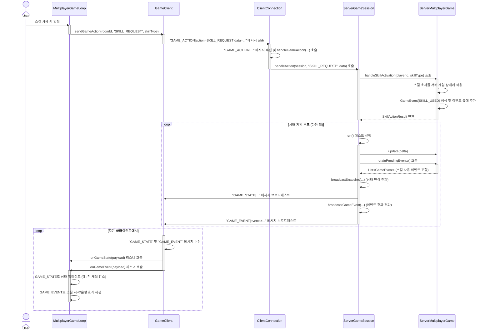

```mermaid
sequenceDiagram
    actor User
    participant MGL as MultiplayerGameLoop
    participant GC as GameClient
    participant CC as ClientConnection
    participant SGS as ServerGameSession
    participant SMG as ServerMultiplayerGame

    User->>MGL: 스킬 사용 키 입력
    activate MGL
    MGL->>GC: sendGameAction(roomId, "SKILL_REQUEST", skillType)
    deactivate MGL
    activate GC
    GC->>CC: "GAME_ACTION|action=SKILL_REQUEST|data=..." 메시지 전송
    deactivate GC

    activate CC
    CC->>CC: "GAME_ACTION|..." 메시지 수신 및 handleGameAction(...) 호출
    CC->>SGS: handleAction(session, "SKILL_REQUEST", data) 호출
    deactivate CC

    activate SGS
    SGS->>SMG: handleSkillActivation(playerId, skillType) 호출
    activate SMG
    SMG->>SMG: 스킬 효과를 서버 게임 상태에 적용
    SMG->>SMG: GameEvent(SKILL_USED) 생성 및 이벤트 큐에 추가
    SMG-->>SGS: SkillActionResult 반환
    deactivate SMG
    deactivate SGS

    loop 서버 게임 루프 (다음 틱)
        SGS->>SGS: run() 메소드 실행
        activate SGS
        SGS->>SMG: update(delta)
        
        SGS->>SMG: drainPendingEvents() 호출
        activate SMG
        SMG-->>SGS: List<GameEvent> (스킬 사용 이벤트 포함)
        deactivate SMG
        
        SGS->>SGS: broadcastSnapshot(...) (상태 변경 전파)
        SGS->>GC: "GAME_STATE|..." 메시지 브로드캐스트
        
        SGS->>SGS: broadcastGameEvent(...) (이벤트 효과 전파)
        SGS->>GC: "GAME_EVENT|events=..." 메시지 브로드캐스트
        deactivate SGS
    end

    loop 모든 클라이언트에서
        activate GC
        GC->>GC: "GAME_STATE" 및 "GAME_EVENT" 메시지 수신
        GC->>MGL: onGameState(payload) 리스너 호출
        GC->>MGL: onGameEvent(payload) 리스너 호출
        deactivate GC
        activate MGL
        MGL->>MGL: GAME_STATE로 상태 업데이트 (예: 적 체력 감소)
        MGL->>MGL: GAME_EVENT로 스킬 시각/음향 효과 재생
        deactivate MGL
    end
```