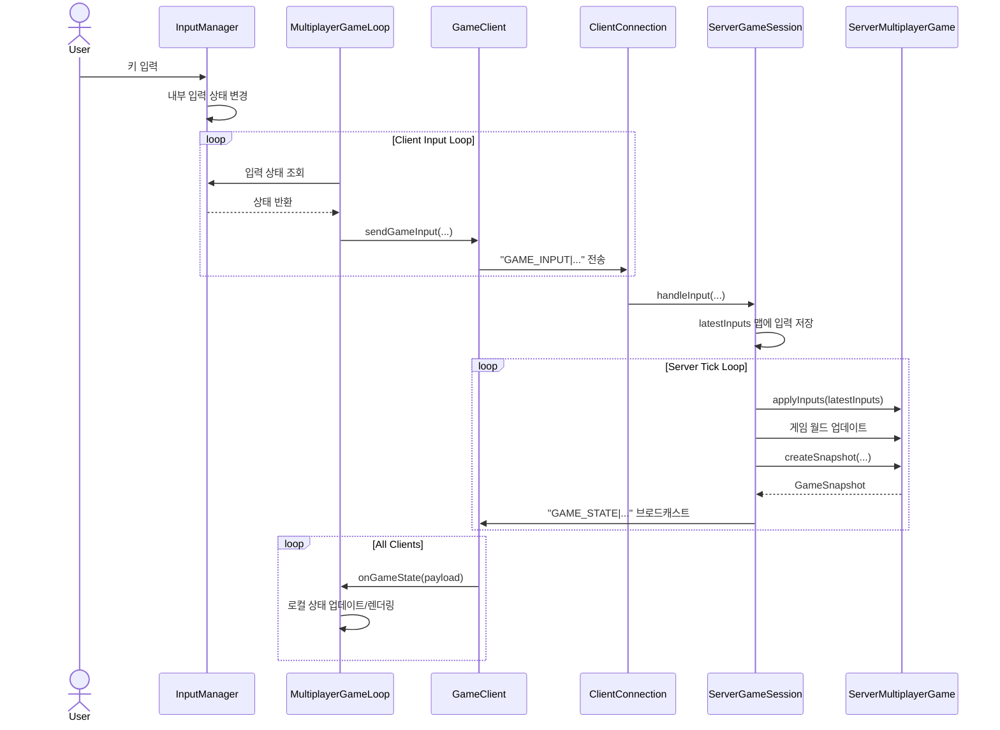

```mermaid
sequenceDiagram
    actor User
    participant IM as InputManager
    participant MGL as MultiplayerGameLoop
    participant GC as GameClient
    participant CC as ClientConnection
    participant SGS as ServerGameSession
    participant SMG as ServerMultiplayerGame

    User->>IM: 키 입력
    IM->>IM: 내부 입력 상태 변경

    loop Client Input Loop
        MGL->>IM: 입력 상태 조회
        IM-->>MGL: 상태 반환
        MGL->>GC: sendGameInput(...)
        GC->>CC: "GAME_INPUT|..." 전송
    end

    CC->>SGS: handleInput(...)
    SGS->>SGS: latestInputs 맵에 입력 저장

    loop Server Tick Loop
        SGS->>SMG: applyInputs(latestInputs)
        SGS->>SMG: 게임 월드 업데이트
        SGS->>SMG: createSnapshot(...)
        SMG-->>SGS: GameSnapshot
        SGS->>GC: "GAME_STATE|..." 브로드캐스트
    end

    loop All Clients
        GC->>MGL: onGameState(payload)
        MGL->>MGL: 로컬 상태 업데이트/렌더링
    end
```