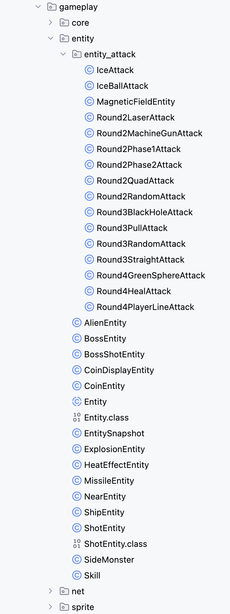
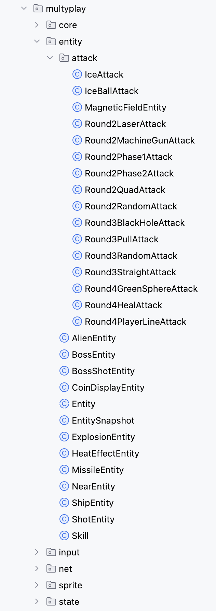

# 리팩토링 상세 내용

## 1. 공통 로직 및 구조 리팩토링

### **중복 엔티티 클래스 통합 - 151c1478, 774c3a79 커밋**
**문제:** 싱글플레이와 멀티플레이 모드에서 엔티티 로직 중복
**냄새:** **중복 코드 (Duplicated Code)**
**냄새에 대한 자세한 내용:**
기존에는 싱글플레이(`gameplay` 패키지)와 멀티플레이(`multyplay` 패키지)가 거의 동일한 엔티티 클래스(예: `AlienEntity`, `ShotEntity`)를 각각 가지고 있었습니다. 이로 인해 기능 변경 시 양쪽 코드를 모두 수정해야 했으며, 이는 유지보수 비용을 증가시키고 잠재적인 버그를 유발하는 원인이 되었습니다.
- 이미지




**대상:**
*   `src/main/java/org/newdawn/spaceinvaders/gameplay/entity/` 내의 엔티티 클래스들
*   `src/main/java/org/newdawn/spaceinvaders/multyplay/` 내의 엔티티 클래스들

**적용 기법:**
**공통 슈퍼클래스 추출 (Extract Superclass)** 기법을 사용했습니다.
두 패키지에서 중복되는 필드(예: `x`, `y`, `sprite`, `game`)와 메서드(예: `getX`, `getY`, `draw`)를 포함하는 `BaseEntity`라는 추상 클래스를 `common/entity` 패키지에 생성했습니다. 이후 각 게임 모드의 엔티티들이 이 `BaseEntity`를 상속받도록 하여 중복 코드를 제거하고 상속을 통해 코드를 재사용하도록 구조를 개선했습니다.

**개선 전 코드 (핵심 부분):**
```java
// in gameplay/AlienEntity.java
public class AlienEntity {
    protected int x;
    protected int y;
    protected Sprite sprite;
    // ... 필드 및 메서드 중복
}

// in multyplay/AlienEntity.java
public class AlienEntity {
    protected int x;
    protected int y;
    protected Sprite sprite;
    // ... 필드 및 메서드 중복
}
```

**개선 후 코드 (핵심 부분):**
```java
// in common/entity/BaseEntity.java
public abstract class BaseEntity {
    protected int x;
    protected int y;
    protected Sprite sprite;
    // ... 공통 필드 및 메서드
}

// in gameplay/AlienEntity.java
public class AlienEntity extends BaseEntity {
    // ... gameplay 고유 로직
}

// in multyplay/AlienEntity.java
public class AlienEntity extends BaseEntity {
    // ... multyplay 고유 로직
}
```

---

## 2. `multyplay` 패키지 리팩토링

### **사용되지 않는 매개변수 제거 - 8e1244b9 커밋**
**문제:** 메서드에서 사용되지 않는 불필요한 매개변수 존재
**냄새:** **긴 매개변수 목록 (Long Parameter List)**
**냄새에 대한 자세한 내용:**
`RemoteRound4GreenSphere` 생성자가 `meta` 매개변수를 받았지만, 실제 내부 로직에서는 전혀 사용하지 않았습니다. 이는 코드를 혼란스럽게 만들고, 해당 매개변수가 어떤 역할을 할 것이라는 잘못된 기대를 심어줄 수 있는 불필요한 코드였습니다.

**대상:**
*   `RemoteRound4GreenSphere` 생성자 및 생성자 호출부

**적용 기법:**
**매개변수 제거 (Remove Parameter):** 사용되지 않는 `meta` 매개변수를 생성자 시그니처에서 제거하고, 이 생성자를 호출하는 `createRemoteEntity` 메서드 내의 호출 코드에서도 해당 인자를 전달하지 않도록 수정하여 코드를 간결하고 명확하게 만들었습니다.

**개선 전 코드 (핵심 부분):**
```java
// in createRemoteEntity method
case "Round4GreenSphereAttack":
    return new RemoteRound4GreenSphere(snapshot, meta); // 불필요한 meta 전달

// RemoteRound4GreenSphere class
RemoteRound4GreenSphere(EntitySnapshot snapshot, Map<String, String> meta) { // 사용되지 않는 meta 파라미터
    super("sprites/Boss_Attack/5round1.gif", (int) Math.round(snapshot.x), (int) Math.round(snapshot.y));
}
```

**개선 후 코드 (핵심 부분):**
```java
// in createRemoteEntity method
case "Round4GreenSphereAttack":
    return new RemoteRound4GreenSphere(snapshot);

// RemoteRound4GreenSphere class
RemoteRound4GreenSphere(EntitySnapshot snapshot) {
    super("sprites/Boss_Attack/5round1.gif", (int) Math.round(snapshot.x), (int) Math.round(snapshot.y));
}
```


### **생성자 복잡도 감소 - 3be08817 커밋**
**문제:** 생성자가 너무 많은 초기화 작업을 수행
**냄새:** **긴 메서드 (Long Method)**
**냄새에 대한 자세한 내용:**
`MultiplayerGameCanvas`의 생성자가 캔버스 설정, 각종 컴포넌트(Manager, Renderer) 초기화, 입력 핸들러 등록 등 너무 많은 책임을 한 번에 수행하고 있었습니다. 이로 인해 인지 복잡도가 20으로 높았으며, 코드의 가독성이 떨어지고 각 초기화 단계의 역할을 파악하기 어려웠습니다.

**대상:**
*   `MultiplayerGameCanvas` 생성자

**적용 기법:**
**메서드 추출 (Extract Method):** 생성자의 로직을 책임에 따라 별도의 private 메서드로 분리했습니다.
*   `initCanvas()`: 캔버스 자체의 속성 설정
*   `initComponents()`: 핵심 컴포넌트 객체 생성 및 초기화
*   `initInputHandlers()`: 키보드, 마우스 이벤트 리스너 등록
    이를 통해 생성자는 각 초기화 메서드를 순서대로 호출하는 역할만 맡게 되어 코드가 간결해지고, 각 메서드의 이름만으로 어떤 작업이 수행되는지 명확히 알 수 있게 되었습니다.

**개선 전 코드 (핵심 부분):**
```java
public MultiplayerGameCanvas(...) {
    // Canvas 설정 로직...
    setPreferredSize(new Dimension(800, 600));
    // ...

    // 컴포넌트 초기화 로직...
    this.gameStateManager = new MultiplayerGameStateManager();
    this.skillManager = new MultiplayerSkillManager(this);
    // ...

    // 입력 핸들러 등록 로직...
    addKeyListener(new KeyAdapter() { ... });
    addMouseListener(new MouseAdapter() { ... });
}
```

**개선 후 코드 (핵심 부분):**
```java
public MultiplayerGameCanvas(...) {
    initCanvas();
    initComponents();
    initInputHandlers();
    initEntities();
}

private void initCanvas() {
    setPreferredSize(new Dimension(800, 600));
    // ...
}

private void initComponents() {
    this.gameStateManager = new MultiplayerGameStateManager();
    this.skillManager = new MultiplayerSkillManager(this);
    // ...
}

private void initInputHandlers() {
    addKeyListener(new KeyAdapter() { ... });
    addMouseListener(new MouseAdapter() { ... });
}
```


### **메서드 복잡도 감소 및 팩토리 패턴 도입 - 7ffd2349 커밋**
**문제:** 일부 메서드가 너무 길고 복잡하며, 객체 생성을 위한 `switch`문이 비대함
**냄새:** **긴 메서드 (Long Method) 및 높은 순환 복잡도 (High Cyclomatic Complexity)**
**냄새에 대한 자세한 내용:**
`createRemoteEntity` 메서드는 수많은 `case`를 가진 거대한 `switch` 문으로 구성되어 새로운 엔티티 타입 추가 시 수정이 매우 불편했습니다(OCP 위반). 또한 `update`, `render`, `handleGameplayKeyPressed`와 같은 메서드들도 여러 책임(상태 업데이트, 렌더링, 입력 처리 등)을 한 곳에서 처리하여 인지 복잡도가 높았습니다.

**대상:**
*   `MultiplayerGameCanvas`의 `update`, `render`, `createRemoteEntity` 등 복잡한 메서드들
*   `MultiplayerInputManager`의 `handleGameplayKeyPressed` 메서드

**적용 기법:**
1.  **메서드 추출 (Extract Method):** 긴 메서드의 논리적 단계를 각각의 작은 private 메서드로 분리하여 가독성과 유지보수성을 높였습니다. (예: `update()` -> `updateRemote()`, `updateLocal()`)
2.  **팩토리 패턴 (Factory Pattern):** `createRemoteEntity`의 `switch` 문을 `Map<String, Function>`을 사용하는 팩토리로 대체했습니다. 엔티티 타입 문자열을 키로, 생성자 참조를 값으로 하는 맵을 구축하여, 새로운 엔티티 추가 시 `switch` 문을 수정하는 대신 맵에 새로운 항목만 추가하면 되도록 구조를 개선했습니다.

**개선 전 코드 (update 함수 핵심 부분):**
```java
// in MultiplayerGameCanvas.java
public void update(long delta) {
    if (isRemote) {
        // 원격 플레이어 업데이트 로직...
        return;
    }

    // 로컬 플레이어 업데이트 로직
    // 엔티티 이동 로직
    for (Entity entity : entities) {
        entity.move(delta);
    }

    // 플레이어 함선 이동 로직
    if (leftPressed && ship.getX() > 10) {
        ship.setHorizontalMovement(-moveSpeed);
    } else if (rightPressed && ship.getX() < 750) {
        ship.setHorizontalMovement(moveSpeed);
    }

    // 충돌 감지 로직
    for (Entity entity1 : entities) {
        for (Entity entity2 : entities) {
            if (entity1.collidesWith(entity2)) {
                entity1.collidedWith(entity2);
                entity2.collidedWith(entity1);
            }
        }
    }
    // ... 기타 등등
}
```

**개선 후 코드 (update 함수 핵심 부분):**
```java
// in MultiplayerGameCanvas.java
public void update(long delta) {
    if (isRemote) {
        updateRemote(delta);
    } else {
        updateLocal(delta);
    }
}

private void updateRemote(long delta) { ... }

private void updateLocal(long delta) {
    moveEntities(delta);
    updateShipMovement(delta);
    checkCollisions();
    cleanupEntities();
    updateShipReference();
}

private void moveEntities(long delta) { ... }
private void updateShipMovement(long delta) { ... }
private void checkCollisions() { ... }
private void cleanupEntities() { ... }
```

**개선 전 코드 (render 함수 핵심 부분):**
```java
// in MultiplayerGameCanvas.java
public void render(Graphics2D g) {
    // 해상도 스케일링 적용
    g.scale(resolutionManager.getScale(), resolutionManager.getScale());

    // 배경 그리기
    backgroundRenderer.draw(g);

    // 모든 엔티티 그리기
    for (Entity entity : entities) {
        entity.draw(g);
    }

    // UI 그리기 (점수, 생명 등)
    uiRenderer.draw(g);

    // 게임 오버 또는 막간 오버레이 그리기
    if (gameStateManager.isGameOver()) {
        drawGameOverOverlay(g);
    } else if (gameStateManager.isIntermission()) {
        drawIntermissionOverlay(g);
    }
}
```

**개선 후 코드 (render 함수 핵심 부분):**
```java
// in MultiplayerGameCanvas.java
public void render(Graphics2D g) {
    applyResolutionScaling(g);
    drawGameElements(g);
    drawOverlays(g);
}

private void applyResolutionScaling(Graphics2D g) { ... }

private void drawGameElements(Graphics2D g) {
    backgroundRenderer.draw(g);
    for (Entity entity : entities) {
        entity.draw(g);
    }
    uiRenderer.draw(g);
}

private void drawOverlays(Graphics2D g) {
    if (gameStateManager.isGameOver()) {
        drawGameOverOverlay(g);
    } else if (gameStateManager.isIntermission()) {
        drawIntermissionOverlay(g);
    }
}
```

**개선 전 코드 (createRemoteEntity 함수 핵심 부분):**
```java
// in MultiplayerGameCanvas.java
private Entity createRemoteEntity(String entityType, EntitySnapshot snapshot, Map<String, String> meta) {
    switch (entityType) {
        case "Alien":
            return new RemoteAlienEntity(snapshot, meta);
        case "Shot":
            return new RemoteShotEntity(snapshot, meta);
        case "Ship":
            return new RemoteShipEntity(snapshot, meta);
        case "Round2Laser":
            return new RemoteRound2Laser(snapshot, meta);
        // ... 수많은 case 문
        default:
            return createDefaultEntity(snapshot);
    }
}
```

**개선 후 코드 (createRemoteEntity 함수 핵심 부분):**
```java
// in MultiplayerGameCanvas.java - 팩토리 맵 초기화
private void initializeEntityFactories() {
    entityFactories = new HashMap<>();
    entityFactories.put("Alien", RemoteAlienEntity::new);
    entityFactories.put("Shot", RemoteShotEntity::new);
    entityFactories.put("Ship", RemoteShipEntity::new);
    entityFactories.put("Round2Laser", RemoteRound2Laser::new);
    // ... 다른 엔티티 팩토리 등록
}

// createRemoteEntity 메서드
private Entity createRemoteEntity(String entityType, EntitySnapshot snapshot, Map<String, String> meta) {
    BiFunction<EntitySnapshot, Map<String, String>, Entity> factory = entityFactories.get(entityType);
    if (factory != null) {
        return factory.apply(snapshot, meta);
    }
    return createDefaultEntity(snapshot);
}
```

**개선 전 코드 (handleGameplayKeyPressed 함수 핵심 부분):**
```java
// in MultiplayerInputManager.java
public boolean handleGameplayKeyPressed(int keyCode) {
    if (gameStateManager.isPaused() || !gameStateManager.isGameRunning()) {
        return false; // 입력 무시
    }

    // 메뉴 관련 키 처리
    if (keyCode == KeyEvent.VK_ESCAPE) {
        // 일시정지 메뉴 로직
        return true;
    }

    // 스킬 활성화 키 처리
    if (keyCode == KeyEvent.VK_1) {
        activateSkill(1);
        return true;
    } else if (keyCode == KeyEvent.VK_2) {
        activateSkill(2);
        return true;
    }

    // 이동 키 처리
    if (keyCode == KeyEvent.VK_LEFT) {
        // 왼쪽 이동 로직
        return true;
    } else if (keyCode == KeyEvent.VK_RIGHT) {
        // 오른쪽 이동 로직
        return true;
    }
    
    return false;
}
```

**개선 후 코드 (handleGameplayKeyPressed 함수 핵심 부분):**
```java
// in MultiplayerInputManager.java
public boolean handleGameplayKeyPressed(int keyCode) {
    if (shouldIgnoreInput()) {
        return false;
    }

    if (handleMenuKeys(keyCode)) {
        return true;
    }

    if (handleNavigationAndActivationKeys(keyCode)) {
        return true;
    }

    if (handleMovementKeys(keyCode)) {
        return true;
    }
    
    return false;
}

private boolean shouldIgnoreInput() { ... }
private boolean handleMenuKeys(int keyCode) { ... }
private boolean handleNavigationAndActivationKeys(int keyCode) { ... }
private boolean handleMovementKeys(int keyCode) { ... }
```

---

## 3. `common` 패키지 리팩토링

### **메서드 복잡도 감소 (common 패키지) - f47826f6 커밋**
**문제:** 특정 메서드들의 분기문이 너무 많아 이해하기 어려움
**냄새:** **긴 메서드 (Long Method) 및 높은 순환 복잡도 (High Cyclomatic Complexity)**
**냄새에 대한 자세한 내용:**
`BaseAlienEntity.move()`, `BaseSkillManager.getRandomSkillPoints()`, `NearEntity.move()` 메서드는 여러 `if-else` 분기문과 로직이 얽혀 있어 하나의 메서드가 너무 많은 역할을 수행했습니다. 예를 들어, `move()` 메서드는 프레임 업데이트, 방향 전환, 좌표 이동, 경계 처리 등을 모두 담당하여 코드를 파악하고 수정하기 어려웠습니다.

**대상:**
*   `BaseAlienEntity.java`의 `move()` 메서드
*   `BaseSkillManager.java`의 `getRandomSkillPoints()` 메서드
*   `NearEntity.java`의 `move()` 메서드

**적용 기법:**
**메서드 추출 (Extract Method):** 각 메서드의 복잡한 로직을 책임과 역할에 따라 여러 개의 작은 private 메서드로 분리했습니다. 예를 들어, `BaseAlienEntity.move()`는 `updateFrame()`, `updateDirection()`, `handleHorizontalMovement()` 등으로 나누어 각 메서드가 단 하나의 책임을 갖도록 구조를 개선했습니다.

**개선 전 코드 (BaseAlienEntity.move 핵심 부분):**
```java
public void move(long delta) {
    // 프레임 애니메이션 로직
    frameTicker += delta;
    if (frameTicker > frameDuration) {
        frameTicker = 0;
        currentFrame = (currentFrame + 1) % frames.length;
    }

    // 방향 전환 로직
    if (System.currentTimeMillis() - lastDirectionChange > 1000 && Math.random() < 0.02) {
        movingLeft = !movingLeft;
        lastDirectionChange = System.currentTimeMillis();
    }
    
    // 수평 이동 및 경계 처리 로직
    double deltaSeconds = delta / 1000.0;
    if (movingLeft) {
        dx -= moveSpeed * deltaSeconds;
        if (x < 10) x = 10;
    } else {
        dx += moveSpeed * deltaSeconds;
        if (x > 750) x = 750;
    }

    // 수직 이동 로직
    y += Math.sin(System.currentTimeMillis() * 0.001) * 0.2;
    if (y < 0) y = 0;
}
```

**개선 후 코드 (BaseAlienEntity.move 핵심 부분):**
```java
public void move(long delta) {
    updateFrame(delta);
    updateDirection(System.currentTimeMillis());
    handleHorizontalMovement(delta / 1000.0, System.currentTimeMillis());
    handleVerticalMovement(delta);
    clampYPosition();
}

private void updateFrame(long delta) { ... }
private void updateDirection(long currentTime) { ... }
private void handleHorizontalMovement(double deltaSeconds, long currentTime) { ... }
private void handleVerticalMovement(long delta) { ... }
private void clampYPosition() { ... }
```

**개선 전 코드 (BaseSkillManager.getRandomSkillPoints 핵심 부분):**
```java
public int getRandomSkillPoints() {
    double random = Math.random();
    if (game.getRound() < 3) { // 1~2 라운드
        if (random < 0.7) return 1;
        else if (random < 0.9) return 2;
        else return 3;
    } else if (game.getRound() < 5) { // 3~4 라운드
        if (random < 0.6) return 2;
        else if (random < 0.85) return 3;
        else return 4;
    } else { // 5 라운드 이상
        if (random < 0.5) return 3;
        else if (random < 0.8) return 4;
        else return 5;
    }
}
```

**개선 후 코드 (BaseSkillManager.getRandomSkillPoints 핵심 부분):**
```java
public int getRandomSkillPoints() {
    double random = Math.random();
    int round = game.getRound();

    if (round < 3) {
        return getRandomSkillPointsForRound1to2(random);
    } else if (round < 5) {
        return getRandomSkillPointsForRound3to4(random);
    } else {
        return getRandomSkillPointsForRound5plus(random);
    }
}

private int getRandomSkillPointsForRound1to2(double random) {
    if (random < 0.7) return 1;
    if (random < 0.9) return 2;
    return 3;
}
private int getRandomSkillPointsForRound3to4(double random) { ... }
private int getRandomSkillPointsForRound5plus(double random) { ... }
```

**개선 전 코드 (NearEntity.move 핵심 부분):**
```java
public void move(long delta) {
    double deltaSeconds = delta / 1000.0;
    
    // 목표(플레이어)를 향한 방향 벡터 계산
    double targetX = player.getX();
    double targetY = player.getY();
    double dirX = targetX - x;
    double dirY = targetY - y;
    double length = Math.sqrt(dirX * dirX + dirY * dirY);
    dirX /= length;
    dirY /= length;

    // 목표 속도 설정
    double targetVelX = dirX * moveSpeed;
    double targetVelY = dirY * moveSpeed;

    // 현재 속도를 목표 속도로 점진적 변경 (가속)
    velocityX += (targetVelX - velocityX) * acceleration * deltaSeconds;
    velocityY += (targetVelY - velocityY) * acceleration * deltaSeconds;

    // 위치 업데이트
    x += velocityX * deltaSeconds;
    y += velocityY * deltaSeconds;

    // 화면 경계 처리
    if (x < 0) x = 0;
    if (x > 800) x = 800;
    if (y < 0) y = 0;
    if (y > 600) y = 600;
}
```

**개선 후 코드 (NearEntity.move 핵심 부분):**
```java
public void move(long delta) {
    double deltaSeconds = delta / 1000.0;

    updateTargetVelocity();
    updateVelocity(deltaSeconds);
    updatePosition(deltaSeconds);
    clampPosition();
}

private void updateTargetVelocity() { ... }
private void updateVelocity(double deltaSeconds) { ... }
private void updatePosition(double deltaSeconds) { ... }
private void clampPosition() { ... }
```

---

## 4. `room` 패키지 리팩토링

### **메서드 복잡도 감소 (room 패키지) - aa4cb740 커밋**
**문제:** UI 렌더링 메서드가 모든 요소를 한 번에 그려 복잡도가 높음
**냄새:** **긴 메서드 (Long Method)**
**냄새에 대한 자세한 내용:**
`GameClient`의 `getSelfId()`, `handleGameInit()`, `handleRoomState()` 메서드들은 `selfId`를 찾는 복잡한 로직이나 게임 초기화, 방 상태 처리 로직을 한 메서드에서 모두 수행하고 있었습니다. `RoomListCanvas`와 `RoomLobbyCanvas`의 `render()` 메서드 역시 배경, 제목, 플레이어 목록, 채팅 등 화면의 모든 UI 요소를 그리는 코드를 포함하고 있어 매우 길고 복잡했습니다. 이로 인해 코드 가독성이 저하되고 특정 UI 요소의 렌더링 또는 로직 코드를 찾거나 수정하기가 어려웠습니다.

**대상:**
*   `GameClient.java`: `getSelfId()`, `handleGameInit()`, `handleRoomState()`
*   `RoomListCanvas.java`: `render()`
*   `RoomLobbyCanvas.java`: `render()`
*   (참고: `BaseAlienEntity.move()`, `BaseSkillManager.getRandomSkillPoints()`, `NearEntity.move()`는 `common` 패키지 리팩토링에서 상세히 다루었습니다.)

**적용 기법:**
**메서드 추출 (Extract Method):** 각 메서드의 복잡한 로직을 기능 단위로 분리하여 여러 개의 작은 private 메서드로 만들었습니다. 이로써 각 메서드의 책임이 명확해지고, 코드의 가독성과 유지보수성이 크게 향상되었습니다.

**개선 전 코드 (GameClient.getSelfId 핵심 부분):**
```java
// in GameClient.java
public String getSelfId() {
    // 세션 ID로 찾기
    for (Player player : players) {
        if (player.getSessionId().equals(sessionId)) {
            cachedSelfId = player.getId();
            return cachedSelfId;
        }
    }
    // 세션 ID가 없으면 사용자 이름으로 찾기
    for (Player player : players) {
        if (player.getUsername().equals(SpaceInvadersApp.getInstance().getUserManager().getSignedInUser().getUsername())) {
            cachedSelfId = player.getId();
            return cachedSelfId;
        }
    }
    return null;
}
```

**개선 후 코드 (GameClient.getSelfId 핵심 부분):**
```java
// in GameClient.java
public String getSelfId() {
    String foundId = findSelfIdBySessionId();
    if (foundId != null) return foundId;
    return findSelfIdByUsername();
}

private String findSelfIdBySessionId() { ... }
private String findSelfIdByUsername() { ... }
```

**개선 전 코드 (GameClient.handleGameInit 핵심 부분):**
```java
// in GameClient.java
private void handleGameInit(Map<String, Object> message) {
    if (message.containsKey("players")) {
        List<Map<String, Object>> playersData = (List<Map<String, Object>>) message.get("players");
        for (Map<String, Object> playerData : playersData) {
            String playerId = (String) playerData.get("id");
            String username = (String) playerData.get("username");
            // 플레이어 정보 처리...
        }
    }
    // cachedSelfId 업데이트
    this.cachedSelfId = getSelfId();
}
```

**개선 후 코드 (GameClient.handleGameInit 핵심 부분):**
```java
// in GameClient.java
private void handleGameInit(Map<String, Object> message) {
    processPlayersInGameInit(message);
    updateCachedSelfId();
}

private void processPlayersInGameInit(Map<String, Object> message) { ... }
private void updateCachedSelfId() {
    this.cachedSelfId = getSelfId();
}
```

**개선 전 코드 (GameClient.handleRoomState 핵심 부분):**
```java
// in GameClient.java
private void handleRoomState(Map<String, Object> message) {
    // 플레이어 목록 파싱...
    List<Map<String, Object>> playersData = (List<Map<String, Object>>) message.get("players");
    List<Player> updatedPlayers = new ArrayList<>();
    for (Map<String, Object> playerData : playersData) {
        // 플레이어 객체 생성 및 목록 추가...
    }
    this.players = updatedPlayers;
    
    // selfId 해결
    this.cachedSelfId = getSelfId();
    // ...
}
```

**개선 후 코드 (GameClient.handleRoomState 핵심 부분):**
```java
// in GameClient.java
private void handleRoomState(Map<String, Object> message) {
    parsePlayers(message);
    resolveSelfId();
    // ...
}

private void parsePlayers(Map<String, Object> message) { ... }
private void resolveSelfId() {
    this.cachedSelfId = getSelfId();
}
```

**개선 전 코드 (RoomListCanvas.render 핵심 부분):**
```java
// in RoomListCanvas.java
public void render(Graphics2D g) {
    // 배경 그리기
    g.drawImage(backgroundImage, 0, 0, getWidth(), getHeight(), null);

    // 제목 그리기
    g.setFont(new Font("Arial", Font.BOLD, 30));
    g.drawString("방 목록", 50, 50);

    // 방 목록 그리기
    int yOffset = 100;
    for (Room room : rooms) {
        g.drawString(room.getName() + " (" + room.getCurrentPlayers() + "/" + room.getMaxPlayers() + ")", 50, yOffset);
        yOffset += 30;
    }

    // 하단 버튼 그리기
    g.setColor(Color.BLUE);
    g.fillRect(50, 500, 100, 40);
    g.setColor(Color.WHITE);
    g.drawString("새 방", 60, 525);
    // ... 기타 버튼
}
```

**개선 후 코드 (RoomListCanvas.render 핵심 부분):**
```java
// in RoomListCanvas.java
public void render(Graphics2D g) {
    drawBackground(g);
    drawTitle(g);
    drawRoomList(g);
    drawBottomButtons(g);
}

private void drawBackground(Graphics2D g) { ... }
private void drawTitle(Graphics2D g) { ... }
private void drawRoomList(Graphics2D g) { ... }
private void drawBottomButtons(Graphics2D g) { ... }
```

**개선 전 코드 (RoomLobbyCanvas.render 핵심 부분):**
```java
// in RoomLobbyCanvas.java
public void render(Graphics2D g) {
    // 배경 그리기
    g.drawImage(backgroundImage, 0, 0, getWidth(), getHeight(), null);

    // 제목 그리기
    g.setFont(new Font("Arial", Font.BOLD, 30));
    g.drawString("방 로비", 50, 50);

    if (client.isSinglePlayer()) {
        // 싱글 플레이어 UI 요소 그리기
        g.drawString("싱글 플레이어 모드", 50, 100);
    } else {
        // 멀티 플레이어 UI 요소 그리기
        g.drawString("플레이어 목록:", 50, 100);
        int yOffset = 130;
        for (Player player : players) {
            g.drawString(player.getUsername() + (player.isHost() ? " (방장)" : ""), 70, yOffset);
            yOffset += 25;
        }
        // 도움말 텍스트 그리기
        g.drawString("엔터: 게임 시작", 50, 400);
        // 채팅창 그리기
        // ...
    }
}
```

**개선 후 코드 (RoomLobbyCanvas.render 핵심 부분):**
```java
// in RoomLobbyCanvas.java
public void render(Graphics2D g) {
    drawBackground(g);
    drawTitle(g);
    if (client.isSinglePlayer()) {
        drawSinglePlayerUI(g);
    } else {
        drawMultiplayerUI(g);
    }
}

private void drawBackground(Graphics2D g) { ... }
private void drawTitle(Graphics2D g) { ... }
private void drawSinglePlayerUI(Graphics2D g) { ... }
private void drawMultiplayerUI(Graphics2D g) {
    drawPlayerList(g);
    drawHelp(g);
    drawChat(g); // 예를 들어, 채팅 로직도 별도 메서드로 분리
}
private void drawPlayerList(Graphics2D g) { /* ... */ }
private void drawHelp(Graphics2D g) { /* ... */ }
private void drawChat(Graphics2D g) { /* ... */ }
```